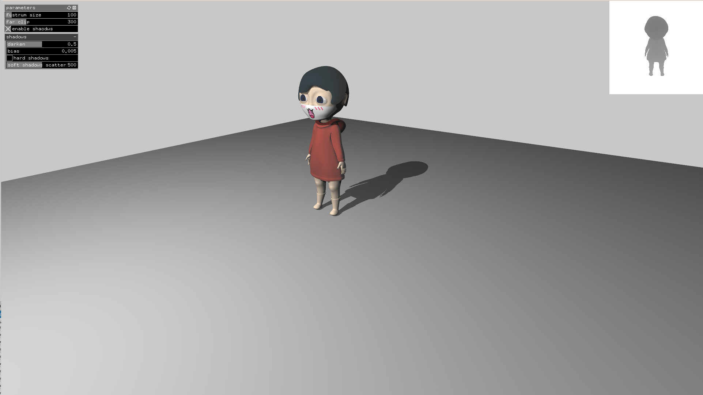

# ofxShadowMap

Shadow map using PCF or gaussian disk sampling for soft borders 

This openFrameworks addon allows to render shadows using ofMaterial and ofLight. Right now only 1 directional light is supported. In the future this might become part of the core materials allowing more lights and light types.

